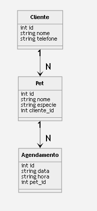

# Projeto Final LPOO - Pet Shop

Sistema de gestão de pet shop desenvolvido em Python com interface gráfica (Tkinter), persistência em PostgreSQL e arquitetura MVC.

## Descrição geral

O sistema permite cadastrar **clientes**, **pets** e **agendamentos** de serviços (banho, tosa, etc.). Cada pet pertence a um cliente, e cada agendamento está vinculado a um pet, conforme os diagramas UML do projeto.

## Estrutura do projeto

```
model/       → classes de domínio (Cliente, Pet, Agendamento)
dao/         → camada de persistência (DAO)
control/     → regras de negócio e validações
view/        → interface gráfica Tkinter
sql/         → scripts de criação das tabelas
diagramas/   → diagramas UML do sistema
```

## Diagrama de classes



## Padrões de projeto

1. **DAO (Data Access Object)** — camada `dao/` com CRUD completo para Cliente, Pet e Agendamento.
2. **Factory Method** — `PetFactory` em `model/pet.py` cria instâncias de `Cachorro`, `Gato`, `Ave` ou `OutroPet` conforme a espécie informada.

## Como executar

1. Instale a dependência:
   ```bash
   pip install psycopg2-binary
   ```

2. Configure o PostgreSQL e crie o banco `Trabalho_Final_LPOO` (credenciais em `conexao.py`).

3. Execute o script SQL:
   ```bash
   psql -U postgres -d Trabalho_Final_LPOO -f sql/schema.sql
   ```

4. Inicie o sistema:
   ```bash
   python main.py
   ```

## Funcionalidades

- CRUD completo de **Clientes** (com filtro por nome e validação de telefone)
- CRUD completo de **Pets** (associados a clientes, com Factory por espécie)
- CRUD completo de **Agendamentos** (validação de data/hora e conflito de horário)
- Menu de navegação entre telas
- Tela **Sobre** com informações do sistema e autor

## Declaração de uso de IA

- [x] Utilizei IA como ferramenta de apoio.
- **Ferramenta:** Cursor (Composer)
- **Finalidade:** apoio na estruturação do projeto e documentação.
- **Validação:** Todo o código gerado foi revisado e adaptado ao padrão do projeto de referência da disciplina.

## Descrição do Sistema
**O sistema tem como objetivo gerenciar um pet shop, permitindo o controle de clientes, pets e agendamentos de serviços.**
**O sistema será utilizado por atendentes do pet shop para registrar clientes e seus animais e também para organizar os agendamentos de serviços como banho e tosa.**
**O problema que o sistema resolve é a falta de organização no controle de atendimentos e clientes, permitindo centralizar as informações e facilitar consultas.**
**O público-alvo são funcionários de pet shops que necessitam de uma ferramenta simples para gerenciamento básico de operações.**

## Requisitos Funcionais:
**Cadastrar cliente**
**Editar cliente**
**Remover cliente**
**Consultar cliente**
**Cadastrar pet**
**Associar pet a um cliente**
**Consultar pets de um cliente**
**Criar agendamento**
**Consultar agendamentos**
**Cancelar agendamento**

# Requisitos não Funcionais:
**O sistema deve ser desenvolvido em Python**
**O sistema deve utilizar programação orientada a objetos**
**O sistema deve apresentar interface simples e intuitiva**
**O sistema deve responder às ações do usuário em tempo adequado**
**O sistema deve permitir fácil manutenção e expansão**

# Regras de negocio:
**Um cliente pode possuir um ou mais pets cadastrados**
**Um pet deve estar associado a apenas um cliente**
**Um agendamento deve possuir data e horário válidos**
**Não pode haver dois agendamentos no mesmo horário para o mesmo pet**